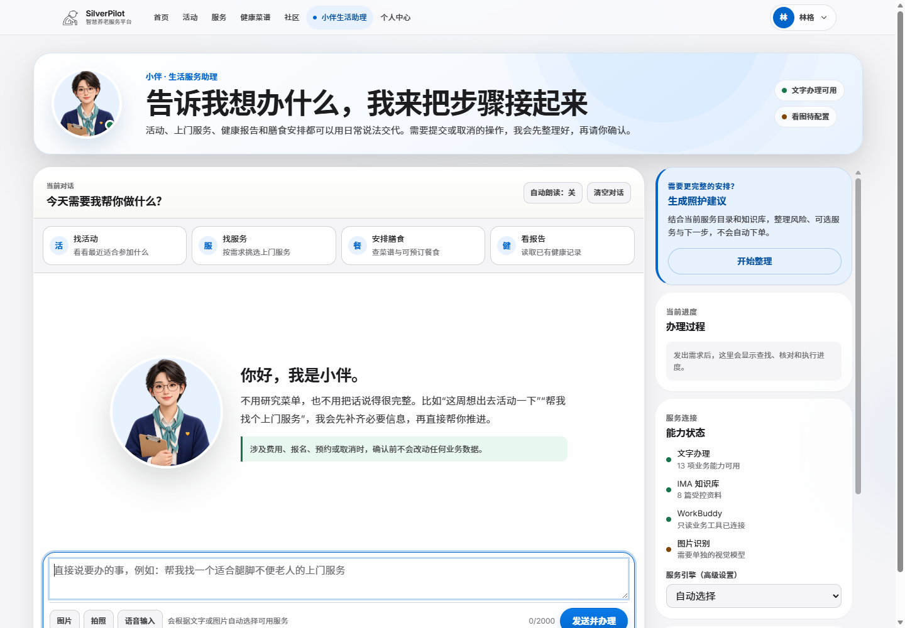
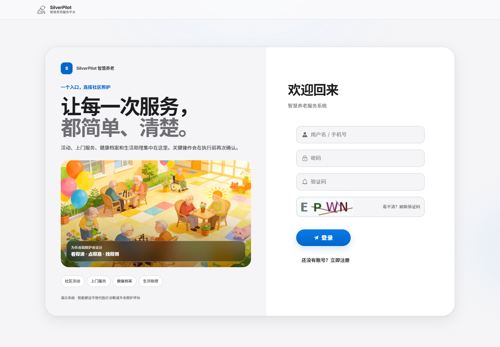
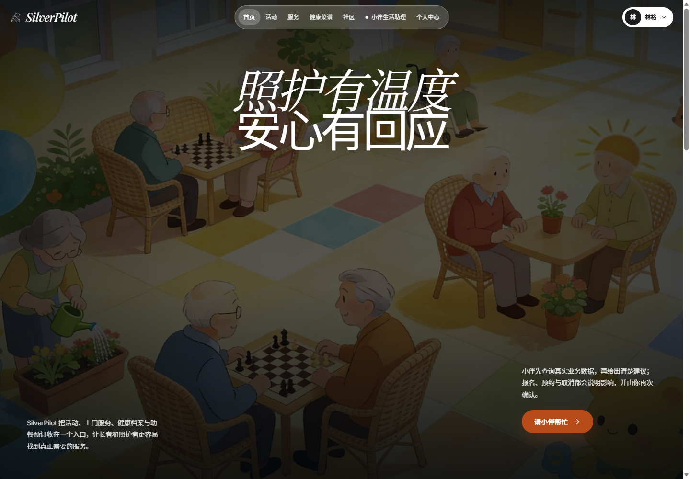
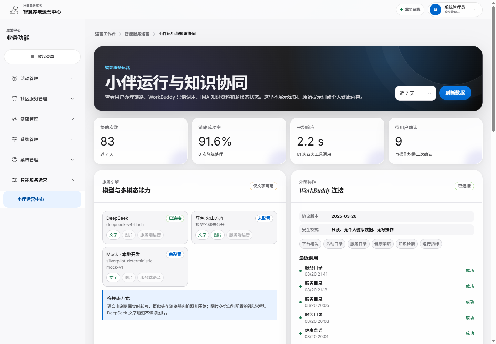
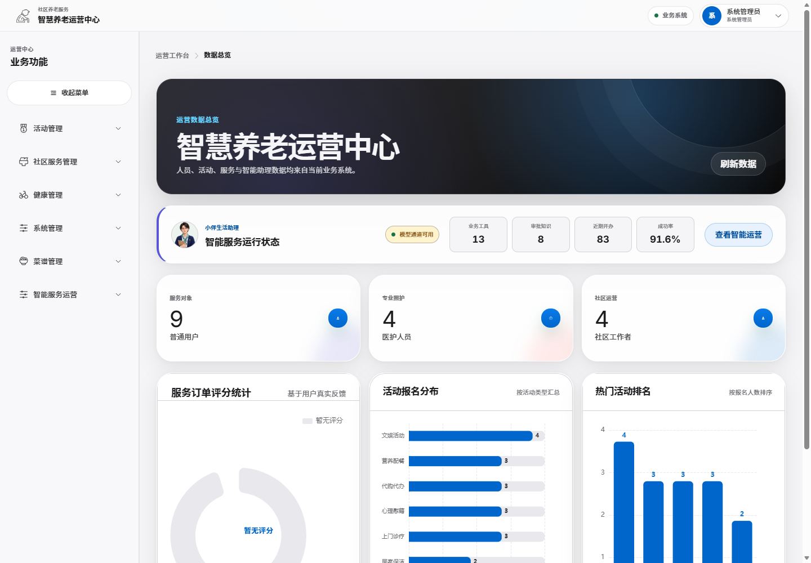
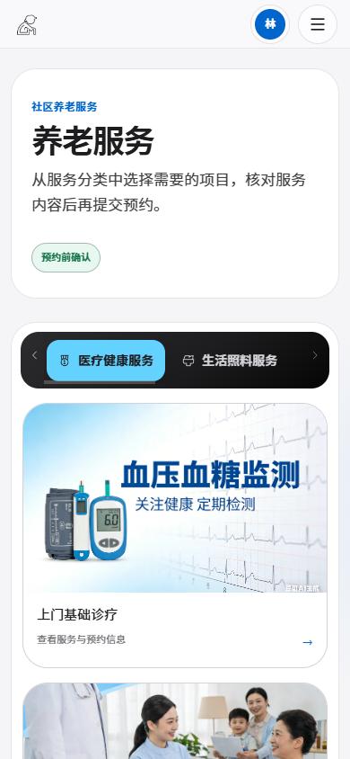
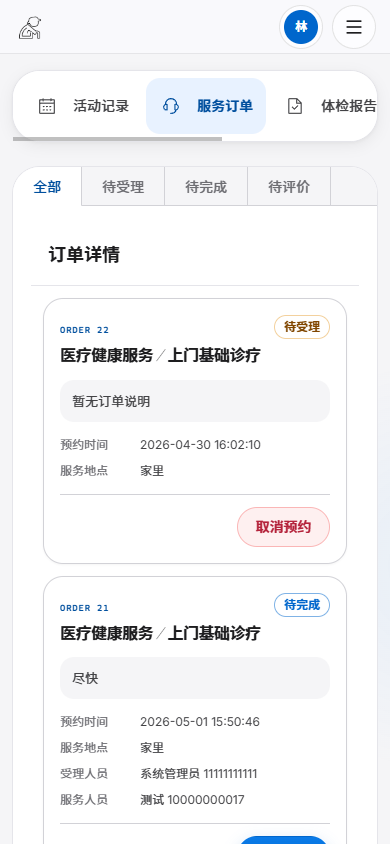
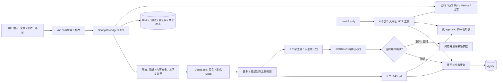

<div align="center">
  <h1>SilverPilot</h1>
  <p><strong>智慧养老业务 Agent 平台</strong></p>
  <p>让养老服务的查询、规划与办理建立在真实数据、人工确认与可审计执行之上。</p>
  <p>
    A verifiable, tool-using eldercare service operations Agent built with Spring Boot and Vue.<br />
    Not a scripted chatbot: the model plans, the application authorizes, and the user confirms.
  </p>
</div>

<p align="center">
  <a href=".github/workflows/ci.yml"></a>
  <a href=".github/workflows/codeql.yml"></a>
  <a href=".github/workflows/scorecard.yml"></a>
  <a href=".github/workflows/release.yml"></a>
  <a href="LICENSE"></a>
</p>

<p align="center">
  <a href="runtime-versions.json"></a>
  <a href="SourceCode/cecsmsServe-springboot/pom.xml"></a>
  <a href="SourceCode/cecsmsServe-springboot/pom.xml"></a>
  <a href="SourceCode/cecsmsui-vue/package.json"></a>
</p>

<p align="center">
  <a href="SourceCode/cecsmsServe-springboot/README.md#命令行验证"></a>
  <a href="SourceCode/cecsmsui-vue/README.md#验证"></a>
  <a href="docs/agent-evaluation-live.json"></a>
  <a href="docs/JAVA_DEPENDENCY_CHECK.md"></a>
  <a href="docs/VALIDATION_REPORT.md"></a>
</p>

<p align="center">
  <a href="docs/screenshots/agent-workspace-20260821-0202.png">
    
  </a>
</p>
<p align="center"><sub>当前工作区 · 全 Docker 无缓存重建 · Microsoft Edge · 1440 × 1000 · 2026-08-21 02:02 CST</sub></p>

<p align="center">
  <a href="#按任务阅读">按任务阅读</a> ·
  <a href="#项目概览">项目概览</a> ·
  <a href="#快速开始">快速开始</a> ·
  <a href="#界面快照">界面快照</a> ·
  <a href="#为什么是-agent">Agent 架构</a> ·
  <a href="#核心能力">核心能力</a> ·
  <a href="#质量与验证">质量证据</a> ·
  <a href="#运行与开发">运行与开发</a> ·
  <a href="#文档地图">文档地图</a>
</p>

## 按任务阅读

| 你的目标 | 从这里开始 | 成功标志 |
| --- | --- | --- |
| 5 分钟内运行完整项目 | [快速开始](#快速开始) | 四个容器健康，登录页和后端代理可访问 |
| 用 IDEA / VSCode 断点开发 | [运行与开发](#运行与开发) | Redis 由 Docker 管理，Java/Vite 分别由 IDE 管理 |
| 修改后端或 Agent | [后端 README](SourceCode/cecsmsServe-springboot/README.md) | `mvnw.cmd clean verify` 通过 |
| 修改前端或排查图片 | [前端 README](SourceCode/cecsmsui-vue/README.md) | `npm run check` 与目标浏览器回归通过 |
| 修改表结构或种子数据 | [数据库 README](database/README.md) | 临时 schema 导入、约束和媒体校验通过 |
| 修改知识或 Agent 评测 | [知识库治理](knowledge-base/README.md)、[评测集](evaluation/README.md) | 结构门禁通过，并按变更范围重跑在线契约 |
| 接入 WorkBuddy / ima | [接入指南](docs/WORKBUDDY_IMA_QUICKSTART.md) | MCP 只出现 6 个只读工具，知识来源可追溯 |
| 准备发布或生产部署 | [发布流程](docs/RELEASE_PROCESS.md)、[部署说明](docs/DEPLOYMENT.md) | 发布门禁、回滚方案与生产前置清单均完成 |

README 负责给出最短成功路径和模块边界；架构、安全、部署及时间点证据放在 `docs/`。遇到数字或版本冲突时，以源码、锁文件、`runtime-versions.json` 和本次实际命令输出为准。

## 项目概览

SilverPilot 将传统智慧养老管理系统升级为“可查询、可规划、可执行、可审计”的业务 Agent。模型负责理解用户目标、规划步骤和选择工具；Spring Boot 后端负责身份、权限、参数、业务事实与最终执行。活动报名、服务预约、助餐预订及取消等写操作，必须先进入 `PENDING`，再由当前用户二次确认。

| 设计原则 | 在 SilverPilot 中的实现 |
| --- | --- |
| 真实数据优先 | 业务工具读取 MySQL 与审核知识库；模型输出不能冒充查询结果 |
| Human-in-the-loop | 5 类写工具只生成待确认动作，确认后才调用受权限保护的业务服务 |
| 可追溯而非黑盒 | 记录 Prompt 版本、工具轨迹、知识来源、Provider、延迟、Token、状态与失败分类 |
| 严格前后端分离 | Vue 只经 HTTP API 访问后端；本地开发由 IDEA 和 VSCode 分别拥有 Java/Vite 进程 |

> [!IMPORTANT]
> **项目定位：**这是个人本地可运行的工程作品与方案验证，不代表已在养老机构生产部署。仓库不虚构客户、收入、用户规模、商业转化或医疗准确率。健康内容仅用于信息整理、风险提示与沟通准备，不构成诊断、处方或紧急救援服务。
>
> **证据口径：**带日期的测试、评测、截图与漏洞扫描只代表对应源码、环境、Provider、知识和漏洞数据库的时间点结果，不是永久质量、零漏洞、临床有效性或生产 SLA 承诺。

## 快速开始

### 前置条件

最快的完整评审路径仅需要：

- Windows（当前自动化验收平台）；
- Windows PowerShell 5.1 或 PowerShell 7；
- Docker Desktop 与可用的 `docker compose`；
- 默认端口 `8082`、`8083`、`3307`、`6380` 可用。

全 Docker 模式不要求宿主机安装 JDK、Maven、Node.js 或 MySQL。当前自动化验收以 Windows 为基线；macOS、Linux 与 WSL2 尚未声明为已验证平台。

### 一条命令启动

在 PowerShell 中克隆仓库并执行 Windows 一键入口；它会自动选择 PowerShell 7 或 Windows PowerShell，并只为本次脚本进程处理执行策略：

```powershell
git clone https://github.com/LeiQingliang/silverpilot.git
Set-Location .\silverpilot
.\start-docker.cmd
```

已经下载源码压缩包时，直接进入解压后的仓库根目录执行最后一条命令即可；也可以双击 [`start-docker.cmd`](start-docker.cmd)。启动成功后服务持续在后台运行，关闭启动窗口不会停止项目。需要传递重建、完整审计等高级参数时，也可使用 PowerShell 入口：

```powershell
pwsh -NoProfile -ExecutionPolicy Bypass `
    -File .\scripts\start-project.ps1 `
    -Mode Docker
```

`start-docker.cmd` 会在启动成功后打开登录页，并保留显示运行状态的窗口。回车、关闭窗口或中断启动程序后，服务继续在 Docker 中运行。自动化调用可设置 `SILVERPILOT_NO_PAUSE=1`，或直接使用上述 PowerShell 入口。停止项目请执行 `stop-project.cmd`。显式传入 `-WaitForStop` 时，需要输入 `STOP` 才会停止，直接回车仍保持服务运行；浏览器无法打开也不会关闭已就绪的服务。启动失败会保留已有容器和数据，便于查看日志及再次启动。两种入口都会准备被 Git 忽略的本机环境文件、生成强随机运行密钥并保存仅当前 Windows 用户可解密的 DPAPI 备份，然后按 MySQL → Redis → 后端 → 前端的依赖顺序启动。每次启动都会先验证种子 SQL 的 48 个图片 URL 确实对应根 `image/` 中的真实文件，再校验运行数据库中的全部图片可经前端代理读取。只有四个服务和图片链路均健康后，脚本才会报告成功；不要只凭“容器已创建”判断项目可用。

`clean-project-residue.cmd` 默认只清理停止后的残留；发现运行、重启或暂停中的容器，或本地 Java/Vite/启动进程时，会跳过清理并保留运行状态、日志和缓存。启动、切换、停止过程中也会跳过，避免清理操作使后端提前退出。确实需要同时停止本项目进程并完整清理时，使用 `clean-project-residue.cmd --stop-running`；数据库卷和上传数据仍会保留。

更新后如果仍在使用已经打开的旧页面，请先到登录页按一次 `Ctrl+F5`。入口 HTML 会重新校验版本，并声明中文及禁止自动翻译，避免旧资源或浏览器改写页面节点影响登录后的动态界面。

| 服务 | 默认地址 | 成功标准 |
| --- | --- | --- |
| Web 应用 | <http://127.0.0.1:8082/login> | 登录页正常加载 |
| 后端健康 | <http://127.0.0.1:8083/actuator/health> | 返回 `status: UP` |
| MCP | `http://127.0.0.1:8083/mcp` | 使用独立 MCP Key 完成 JSON-RPC 初始化 |
| MySQL | `127.0.0.1:3307`（模板默认） | 仅回环发布且通过业务表健康检查 |
| Redis | `127.0.0.1:6380` | 仅回环发布、认证 `PONG`、AOF 已启用 |

实际宿主端口以本机 `.env.docker` 为准，可运行 `.\scripts\docker-dev.ps1 status` 查看，不要在截图、Issue 或聊天中粘贴整个环境文件。如果 Windows 将默认端口划入 TCP 排除范围，启动器会明确报告并要求选择空闲端口，不会结束无关进程。

如果系统提示本地 `.ps1` “未数字签名”，不要修改整机执行策略；只为当前命令显式使用 `pwsh -NoProfile -ExecutionPolicy Bypass -File <脚本> <参数>`。根目录 `.cmd` 启停入口已经内置这一处理。

可选健康检查：

```powershell
Invoke-RestMethod 'http://127.0.0.1:8083/actuator/health' |
    ConvertTo-Json -Depth 6
```

### 演示账号

| 角色 | 用户名 | 密码 |
| --- | --- | --- |
| 管理员 | `admin` | `123456` |
| 普通用户 | `linge` | `123456` |

这些账号和密码仅用于本机合成演示数据；任何联网部署都必须删除演示账号或更换强密码。

<details>
<summary><strong>五分钟演示路径</strong></summary>

1. 使用普通用户登录并进入“小伴服务”；
2. 询问“有哪些可报名活动”，核对工具轨迹与数据库中的真实活动 ID；
3. 请求预约一项服务，确认系统只生成待确认卡片，再选择取消或确认；
4. 搜索“写操作人工确认安全策略”，核对回答中的 `[KB:...]` 知识来源；
5. 使用管理员登录，打开“小伴运行”和运营总览，查看脱敏运行记录与指标。

没有模型凭据时，传统业务功能仍可运行。Agent 演示需要按[模型配置与 Mock](#模型配置与-mock)配置真实 Provider，或显式启用只用于本地契约验证的 Mock。

</details>

### 停止项目

```powershell
.\stop-project.cmd
```

正常停止会保留 MySQL、Redis 和上传文件命名卷。删除数据卷是破坏性操作，只应在确认不再需要演示数据时按[部署说明](docs/DEPLOYMENT.md)执行显式 reset 流程。

同一工作目录的启动、切换和停止不能同时执行；重复点击会提示等待后重试。停止入口按容器的工作目录标签识别项目，配置文件丢失时仍可停止已有容器；无法连接 Docker 或停止失败时会返回错误。本地模式先在 VSCode/IDEA 停止应用，再用此入口停止 Redis。

## 界面快照

> [!NOTE]
> 本页 7 张截图于 **2026-08-21 02:02（Asia/Shanghai）** 从当前工作区无缓存重建的全 Docker 栈重新采集，使用 Microsoft Edge、合成演示数据和固定浅色产品主题。定向桌面/手机矩阵覆盖 7 个 README 场景，共 **14/14** 通过；未发现空白页、横向溢出、控件相交、可见坏图、运行时异常、控制台警告或 HTTP 5xx。截图文件名包含本次采集批次，避免 GitHub/CDN 继续命中旧图片 URL；截图仍是时间点证据，不替代当前浏览器验收。

顶部主图是普通用户的“小伴服务”工作台；点击任意图片可查看原始分辨率。

| 统一登录入口 | 社区养老服务首页 |
| --- | --- |
| [](docs/screenshots/login-20260821-0202.png) | [](docs/screenshots/community-home-20260821-0202.png) |

| 小伴运行、模型与知识协同 | 智慧养老运营数据总览 |
| --- | --- |
| [](docs/screenshots/agent-operations-20260821-0202.png) | [](docs/screenshots/operations-dashboard-20260821-0202.png) |

| 移动端养老服务 | 移动端服务订单 |
| --- | --- |
| [](docs/screenshots/mobile-services-20260821-0202.png) | [](docs/screenshots/mobile-service-orders-20260821-0202.png) |

<details>
<summary><strong>复现 README 截图门禁</strong></summary>

先按[快速开始](#快速开始)启动全 Docker 栈，再从仓库根目录执行：

```powershell
Push-Location .\SourceCode\cecsmsui-vue
$env:CECSMS_QA_BASE_URL = 'http://127.0.0.1:8082'
$env:CECSMS_QA_VIEWPORTS = 'desktop,mobile'
$env:CECSMS_QA_THEMES = 'light'
$env:CECSMS_QA_REDUCED_MOTION = 'true'
$env:CECSMS_QA_SCREENSHOTS = 'all'
$env:CECSMS_QA_ROUTES = '/login,/front/home/FrontHomeView,/front/service/FrontServiceView,/front/myService/MyServiceView,/front/ai/AiChat,/IndexView,/AgentOperationsView'
npm run audit:display
Pop-Location
Remove-Item Env:\CECSMS_QA_BASE_URL,Env:\CECSMS_QA_VIEWPORTS,Env:\CECSMS_QA_THEMES,Env:\CECSMS_QA_REDUCED_MOTION,Env:\CECSMS_QA_SCREENSHOTS,Env:\CECSMS_QA_ROUTES -ErrorAction SilentlyContinue
```

命令会从被 Git 忽略的本机环境文件读取测试所需密钥，只把截图写入输出中报告的临时目录；不得把 `.env.docker`、Token、真实个人资料或健康数据纳入截图。完整 34 路由门禁只需不设置 `CECSMS_QA_ROUTES`，或在执行前运行 `Remove-Item Env:\CECSMS_QA_ROUTES -ErrorAction SilentlyContinue`。更新公开 README 时必须为新截图使用新的采集批次文件名，不能只覆盖旧 URL 下的图片。

</details>

## 为什么是 Agent

一次 Agent 请求会经过安全预检、上下文裁剪、版本化 Prompt、Provider 路由、工具规划、真实业务调用、结果回填和运行审计。模型不能直接写数据库，也不能自行宣称写操作成功。



### 工具与信任边界

| 通道 | 数量 | 能力 | 明确禁止 |
| --- | ---: | --- | --- |
| Web Agent 只读 | 8 | 活动、服务、本人订单、本人健康报告、菜谱、本人助餐订单、审核知识 | 越权读取、直接写库 |
| Web Agent 待确认写入 | 5 | 活动报名、服务预约/取消、助餐预订/取消 | 跳过确认、自报其他用户身份 |
| WorkBuddy MCP | 6 | 平台概况、活动、服务、菜谱、审核知识、匿名聚合 Agent 指标 | 个人健康数据、个人订单、任何写操作 |

<details>
<summary><strong>查看 13 个 Web Agent 工具名</strong></summary>

**只读：**`list_available_activities`、`list_services`、`my_service_orders`、`my_health_reports`、`get_health_report_detail`、`list_recipes`、`my_recipe_orders`、`search_knowledge_base`。

**需人工确认：**`join_activity`、`book_service`、`cancel_service_order`、`book_recipe`、`cancel_recipe_order`。

</details>

完整组件责任、读写时序和数据边界见[系统架构](docs/ARCHITECTURE.md)；Prompt、RAG、结构化输出、成本与评测设计见 [AI Harness](docs/AI_HARNESS.md)。

## 核心能力

| 领域 | 已实现能力 |
| --- | --- |
| 养老业务 | 活动、服务分类与预约、健康档案、助餐菜谱与订单、留言板、用户与角色管理、Excel 导出 |
| Agent 执行 | 多轮工具编排、模糊指令补全、结构化照护导航、知识引用、执行轨迹、待确认动作、失败降级 |
| 安全与隐私 | JWT 身份、角色与资源所有权、BCrypt、参数校验、内容安全、脱敏、限流、一次性验证码、写操作幂等 |
| AI Harness | Provider 路由、Prompt 版本/指纹、JSON 契约、上下文与 Token 上限、受控 RAG、缓存、评测集与成本指标 |
| 多模态交互 | DeepSeek 文本工具通道；豆包配置完整后处理图片；浏览器语音输入、朗读、摄像头与上传前压缩 |
| 可观测性 | Request ID、Agent 运行/动作审计、Prometheus 指标、成功率、延迟、Token、工具数与失败分类 |
| 前端体验 | 响应式社区养老界面、移动端业务卡片、断网恢复、可访问性约束、WebP 优先与原图回退 |
| 工程交付 | 全 Docker 快速评审、严格 IDEA + VSCode 分离开发、CI/Release 门禁、SBOM/校验和/构建证明流水线 |

健康方案用于服务导航和沟通辅助，不是医疗器械功能。紧急症状规则会优先建议联系 `120` 或线下专业人员；任何临床判断仍应由有资质人员负责。

## 模型配置与 Mock

| Provider | 用途 | 当前证据边界 |
| --- | --- | --- |
| DeepSeek | 文本推理与业务工具编排 | 2026-08-20 真实完整契约 `16/16` 与实时 smoke 通过 |
| 火山方舟 / 豆包 | 图片理解通道 | 代码与路由边界已实现；当前未宣称真实在线视觉效果、成本或稳定性 |
| 显式 Mock | 无外部凭据时验证本地只读工具契约 | 不代表模型语义质量，不伪造图片识别或写操作成功 |

真实凭据只能写入被 Git 忽略的 `.env.docker`。禁止把密钥写入源码、README、`VITE_*`、截图、Issue、构建参数或提交记录。完整键名见 [`.env.docker.example`](.env.docker.example)：

```dotenv
SILVERPILOT_DEEPSEEK_API_KEY=replace-locally
SILVERPILOT_DEEPSEEK_MODEL=deepseek-v4-flash
SILVERPILOT_DOUBAO_API_KEY=replace-locally
SILVERPILOT_DOUBAO_MODEL=replace-with-ark-endpoint-or-model-id
```

修改后，全 Docker 模式重新执行：

```powershell
.\scripts\start-project.ps1 -Mode Docker
```

没有模型凭据时，可在本机环境文件中显式设置：

```dotenv
SILVERPILOT_AI_MOCK_ENABLED=true
```

启用 Mock 并重启后，可验证 6 条受支持的只读工具/知识契约：

```powershell
.\scripts\run-agent-evaluation.ps1 `
    -Provider mock `
    -MaxCases 6 `
    -EnvFile .\.env.docker
```

真实 Provider 的完整 16 条语义、安全、写操作和多模态边界契约必须使用实际账号另行执行，不能用 Mock 子集替代。详细配置、错误契约与成本边界见 [Provider 接入说明](docs/LLM_PROVIDER_INTEGRATION.md)。

## 质量与验证

以下是 **2026-08-21** 当前工作区保存并按对应事实源复核的证据，不是永久质量承诺：

| 验证面 | 最近结果 | 适用边界 |
| --- | --- | --- |
| 后端 | `87/87` tests；编译警告门禁；JDK 25 `jdeprscan` 0 命中 | 当前测试集，不等于形式化验证 |
| 前端 | `43/43` 单元/UI 契约测试；5 组属性测试、10,000 个生成用例；ESLint、Knip、生产构建、production audit 通过 | 固定随机种子与当前锁定依赖快照 |
| 全 Docker 启动 | MySQL、Redis、后端、前端 `4/4 healthy`；48 个持久化图片 URL 全部经前端代理可读 | 本机回环演示栈，不代表公网部署可用性 |
| 前后端通信 | 全 Docker 同源 `/api` 矩阵 `97/97` | 主要 API、身份、资源、Agent、MCP 与上传边界 |
| 数据库 | 21 表、18 外键、6 关键索引及 `CHECK TABLE` 通过；临时活动完整 CRUD 后零残留 | 合成演示库，不代表生产迁移演练 |
| Agent | 真实 DeepSeek 完整契约 `16/16`；实时 smoke 通过 | 自动契约，不衡量临床有效性或人工主观质量 |
| 知识治理 | 9 篇文档结构门禁通过，其中 8 篇 `approved` 被运行时索引 | 不等于医学专业复核 |
| 显示回归 | Edge 浅色桌面/手机矩阵 `68/68`（34 个路由）；README 定向截图矩阵 `14/14`（7 个路由） | 不等于 Firefox、Safari、读屏器或真实低端设备验收 |
| Java / 容器 SCA | Dependency-Check 13.0.0：82 个依赖、0 个受影响依赖、0 个未抑制漏洞；4 个运行镜像均为 0 Critical/High | 时间点漏洞数据库；新 CVE 不会自动反映 |

### 复现核心门禁

```powershell
# 源码、后端、前端、知识与评测数据集
.\scripts\verify-project.ps1

# OWASP 官方镜像刷新 + 哈希验证缓存 + 强制离线扫描
.\scripts\invoke-dependency-check.ps1 -Mode All

# 已运行 Docker 栈的健康、同源通信和可清理真实 CRUD
.\scripts\verify-running-stack.ps1 `
    -EnvironmentFile .\.env.docker `
    -FullAudit
```

在完整 Git checkout 中，发布前还应执行：

```powershell
.\scripts\verify-publication-safety.ps1
```

该脚本需要 `.git` 历史；源代码压缩包或缺少 `.git` 的工作目录不能替代历史泄漏检查。运行模式交叉切换可使用 `.\scripts\verify-run-modes.ps1 -FullAudit -CrossSwitch`。

> [!NOTE]
> `-FullAudit` 会创建一条带随机 `QA-DB-*` 标识的临时活动，并在 `finally` 中按 ID 与标识双重限定清理。完整命令、镜像摘要、扫描范围和历史差异见[验证报告](docs/VALIDATION_REPORT.md)。Java SCA 的超时、缓存与到期例外见 [Dependency-Check 说明](docs/JAVA_DEPENDENCY_CHECK.md)。

## 运行与开发

### 两种运行模式

| 场景 | 推荐模式 | 应用进程归属 | 前端地址 |
| --- | --- | --- | --- |
| 快速评审、联调、集成验收 | 全 Docker | Compose 管理 MySQL、Redis、后端、前端 | `http://127.0.0.1:8082` |
| 日常断点开发 | 严格 Local | 本机 MySQL + Docker Redis + IDEA 后端 + VSCode 前端 | `http://127.0.0.1:8081` |

### 严格 IDEA + VSCode 本地开发

本地模式唯一支持的启动顺序是 **Docker Redis → IDEA 后端 → VSCode 前端**。它要求宿主机 MySQL 监听 `127.0.0.1:3306`，并在当前用户环境中配置 `CECSMS_LOCAL_DB_PASSWORD` 或 `CECSMS_DB_PASSWORD`；同时需要 JDK 25、IntelliJ IDEA、Node.js 24.19.0、npm 12.0.2 和 VSCode。

1. 在仓库根目录准备 Redis 与外置配置：

   ```powershell
   .\scripts\start-project.ps1 -Mode Local
   ```

2. 在 IntelliJ IDEA 单独打开 `SourceCode/cecsmsServe-springboot`，或从仓库根项目加载该目录的 `pom.xml`，使用 JDK 25 运行：

   ```text
   com.cecsmsserve.CecsmsServeApplication
   ```

3. 确认后端健康状态为 `UP`，再在 VSCode 单独打开 `SourceCode/cecsmsui-vue`：

   ```powershell
   npm ci
   npm run dev
   ```

`start-local.cmd` 与 `-Mode Local` **只准备 Redis 和配置**，不会启动 Java、Vite 或隐藏进程；`host` profile 会兼容 IDEA 以仓库根或后端模块作为 Working directory，`npm run dev` 会在启动 Vite 前验证后端与 Redis。脚本不会静默升级宿主机工具，也不会结束不属于本项目的端口占用者。

| 组件 | Local | 全 Docker |
| --- | ---: | ---: |
| 前端 | `8081` | `8082` |
| 后端 | `8083` | `8083` |
| MySQL | `3306` | `3307`（可覆盖） |
| Redis | `6380` | `6380`（可覆盖） |

IDEA profile、VSCode 脚本和故障排查分别见[后端 README](SourceCode/cecsmsServe-springboot/README.md)、[前端 README](SourceCode/cecsmsui-vue/README.md)与[部署说明](docs/DEPLOYMENT.md)。

## 技术栈

| 层 | 当前固定基线 |
| --- | --- |
| 后端 | Java 25 LTS、Spring Boot 4.1.0、MyBatis-Plus 3.5.17、Bean Validation、java-jwt 4.6.0、EasyExcel 4.0.3 |
| 数据 | MySQL 9.7.2 LTS、Connector/J 26.7.0、Redis 8.2.9 Extended、HikariCP、幂等迁移 |
| AI | DeepSeek Chat Completions、火山方舟/豆包 Vision、显式 Mock、结构化输出、受控 Markdown RAG |
| 前端 | Vue 3.5.41、Vue Router 5.2.0、Vite 8.2.1、Element Plus 2.14.4、Pinia 4.0.3、Axios 1.19.0、ECharts 6.1.0 |
| 工程 | Maven 3.9.16、Node.js 24.19.0、npm 12.0.2、ESLint 10.8.1、Knip 6.32.2、Dependency-Check 13.0.0 |
| 容器 | Eclipse Temurin 25、Nginx 1.30.4 stable、Ubuntu 26.04 LTS、Alpine 3.24.1、Go 1.27.0 |

[`runtime-versions.json`](runtime-versions.json)、后端 [`pom.xml`](SourceCode/cecsmsServe-springboot/pom.xml)、前端 [`package.json`](SourceCode/cecsmsui-vue/package.json) / `package-lock.json` 与 Dockerfile 是版本事实源。固定、升级和稳定/LTS 验收规则见[版本策略](docs/VERSION_POLICY.md)。

## WorkBuddy 与 ima

SilverPilot 把“实时业务事实”和“稳定规则知识”分成两个边界清晰的通道：

| 通道 | 提供内容 | 明确不提供 |
| --- | --- | --- |
| WorkBuddy MCP | 平台概况、活动、服务、菜谱、审核知识、匿名聚合 Agent 指标 | 个人健康数据、个人订单、任何业务写操作 |
| ima 知识库 | 产品边界、安全策略、养老业务 SOP、健康问答边界、运营口径 | 当前数据库实时状态、未经审核的 AI 产出 |

仓库提供 [`agent-manifest.json`](workbuddy/agent-manifest.json)、[`connector-template.json`](workbuddy/connector-template.json)、[SilverPilot Operator Skill](.codebuddy/skills/silverpilot-operator/SKILL.md) 与 9 篇 `ima-ready` Markdown，其中 8 篇为运行时 `approved`。本地 MCP 地址是 `http://127.0.0.1:8083/mcp`，使用独立 API Key。

同机桌面联调可以使用回环地址；云端 Runtime 无法访问用户电脑的 `127.0.0.1`，必须先部署受保护的 HTTPS MCP，并配置网关限流、来源限制、密钥轮换和审计。仓库模板不等于 WorkBuddy 云端已绑定、ima 已授权或企业 Agent 已发布。完整步骤见 [WorkBuddy + ima 接入指南](docs/WORKBUDDY_IMA_QUICKSTART.md)。

## 安全与生产边界

- `.env.docker`、外置 host 配置、日志、构建输出、本地上传与 Dependency-Check 数据库均被 Git/Docker 构建忽略；
- JWT 身份、角色与资源所有权由后端重新验证，模型和客户端都不能自报其他用户 ID；
- MCP 使用独立高熵密钥，只暴露非个人、只读、非破坏性工具；
- 审计不保存原始 Prompt、图片或思维链，写动作到达终态后清除原始参数；
- Compose 所有宿主端口默认绑定 `127.0.0.1`；这是本地可复现基线，不是互联网生产架构；
- 演示数据库全部使用合成数据，不是来自真实养老机构数据的脱敏副本。

生产部署仍需要 HTTPS/API 网关、托管密钥、备份恢复、集中日志与告警、对象存储、恶意文件扫描、容器签名、负载/容量测试、灾备演练和独立安全评估。漏洞请按根目录[安全策略](SECURITY.md)私密报告；威胁模型、控制矩阵和剩余风险见[安全设计](docs/SECURITY.md)。

### 已知限制

- 当前 RAG 是适合小型审核语料的词项检索，尚未完成向量召回对照实验；
- 豆包在线视觉效果、费用与稳定性尚未使用真实账号完成当前版本评测；
- OWASP 镜像按每日尽力更新，外部镜像不可用且没有 168 小时内有效缓存时会明确失败；
- 文件上传尚未接入生产级恶意内容扫描和对象存储生命周期；
- Firefox、Safari、读屏器、真实低端设备、生产网络、灾备与并发容量仍需独立验收；
- 项目未完成临床验证、医疗器械认证、等保认证或真实机构生产运行证明。

## 版本与发布

当前源码元数据版本为 `1.0.1`，并包含 [`CHANGELOG.md`](CHANGELOG.md) 中尚未发布的 `Unreleased` 改进。版本号遵循 Semantic Versioning；发布工作流设计为从通过保护规则和全部必需检查的 `main` 标签构建 JAR、前端静态包、精确源码包、SPDX 2.3 SBOM、发布清单、`SHA256SUMS` 与 GitHub Artifact Attestations。

> [!WARNING]
> 本地 Release 配置、说明和构建成功不能证明外部 GitHub Release 已公开存在。只有目标仓库可访问、Release/标签/`main` 提交一致，并且 `gh release verify` 与构建证明验证成功后，才能把对应版本称为可下载的正式发布。

发布后验证示例：

```powershell
gh release verify v1.0.1 --repo LeiQingliang/silverpilot
gh attestation verify .\silverpilot-1.0.1-backend.jar `
  --repo LeiQingliang/silverpilot `
  --signer-workflow LeiQingliang/silverpilot/.github/workflows/release.yml
```

资产角色和已知边界见 [v1.0.1 发布说明](docs/releases/v1.0.1.md)；标签、校验、发布、修复与回滚流程见[发布流程](docs/RELEASE_PROCESS.md)。

## 文档地图

| 想完成的任务 | 推荐文档 |
| --- | --- |
| 选择模式、启动、重建、日志与数据卷 | [部署说明](docs/DEPLOYMENT.md) |
| 后端、IDEA、API 与 Profile | [后端 README](SourceCode/cecsmsServe-springboot/README.md) |
| 前端、VSCode、脚本与浏览器回归 | [前端 README](SourceCode/cecsmsui-vue/README.md) |
| Agent 读写时序、组件责任与数据边界 | [系统架构](docs/ARCHITECTURE.md) |
| Prompt、Provider、RAG、评测与成本 | [AI Harness](docs/AI_HARNESS.md)、[Provider 接入](docs/LLM_PROVIDER_INTEGRATION.md) |
| 安全控制、Java SCA、剩余风险与证据 | [安全设计](docs/SECURITY.md)、[Java SCA](docs/JAVA_DEPENDENCY_CHECK.md)、[验证报告](docs/VALIDATION_REPORT.md) |
| UI Token、响应式与可访问性约束 | [前端设计系统](docs/FRONTEND_DESIGN_SYSTEM.md) |
| 稳定/LTS 版本固定与升级 | [版本策略](docs/VERSION_POLICY.md) |
| Release、校验和与回滚 | [发布流程](docs/RELEASE_PROCESS.md)、[v1.0.1 说明](docs/releases/v1.0.1.md) |
| MySQL / Redis | [数据库 README](database/README.md)、[Redis README](redis/README.md) |
| Agent 契约评测 | [评测集 README](evaluation/README.md)、[当前脱敏报告](docs/agent-evaluation-live.json) |
| WorkBuddy / ima | [接入指南](docs/WORKBUDDY_IMA_QUICKSTART.md)、[WorkBuddy README](workbuddy/README.md)、[知识库治理](knowledge-base/README.md) |
| 产品、运营、售前与演示证据 | [`portfolio/`](portfolio/) |

### README 维护约定

- 根 README 只维护产品定位、最短启动路径、跨模块边界和可复现入口；模块细节写入对应子目录 README。
- 测试数量、版本、工具数、表数和截图日期都是时间点事实，只有在对应命令重新通过后才能更新；截图更新必须生成新的采集批次文件名并同步修改 README 引用，避免 GitHub/CDN 缓存旧 URL；历史证据保留在[验证报告](docs/VALIDATION_REPORT.md)。
- 命令默认从其注明的工作目录执行。破坏性命令必须同时写明影响对象、保留项与恢复前提，不能把 `reset -Force` 当作常规排障步骤。
- README 不保存密钥、真实个人/健康数据、完整 `.env.docker` 内容或本机绝对路径；示例只使用占位符和仓库相对路径。
- 优先链接到唯一事实源，避免在多份文档复制长配置表。版本以 [`runtime-versions.json`](runtime-versions.json) 为准，环境变量以模板和后端配置为准，运行模式以[部署说明](docs/DEPLOYMENT.md)为准。

<details>
<summary><strong>仓库结构</strong></summary>

```text
.
├─ SourceCode/
│  ├─ cecsmsServe-springboot/   # Spring Boot 后端、Agent 与版本化 Prompt
│  └─ cecsmsui-vue/             # Vue 前端与浏览器交互
├─ database/                    # MySQL 镜像、初始化 SQL 与契约说明
├─ redis/                       # 校验官方源码后构建的 Redis
├─ knowledge-base/ima-ready/    # Git 治理、ima-ready 的 Markdown 知识源
├─ evaluation/                  # Agent 契约评测数据集
├─ workbuddy/                   # MCP / WorkBuddy 参考模板
├─ portfolio/                   # 产品、运营、售前与面试证据
├─ docs/                        # 架构、安全、部署、发布与验证报告
├─ scripts/                     # 启动、诊断、测试、评测、发布与冒烟脚本
├─ compose.yaml                 # 全 Docker 与 Redis-only 基础设施定义
├─ runtime-versions.json        # 稳定/LTS 版本门禁基线
├─ start-local.cmd              # 仅准备 IDEA + VSCode 所需 Redis/配置
└─ start-docker.cmd             # Windows 全 Docker 一键入口
```

</details>

产品名为 **SilverPilot**。后端模块名是 `cecsmsServe-springboot`，Maven `artifactId` 是 `cecsms-serve`，启动类是 `com.cecsmsserve.CecsmsServeApplication`；前端模块与 npm 包名分别是 `cecsmsui-vue`、`cecsmsui`；演示数据库名为 `a_old`。

## 参与贡献

SilverPilot 接受缺陷修复、测试、文档、可访问性、安全加固和经过论证的功能建议。提交前请阅读[贡献指南](CONTRIBUTING.md)与[行为准则](CODE_OF_CONDUCT.md)，并遵守以下最低要求：

- 不提交 `.env`、密钥、真实个人/健康数据、生产日志或未经核验来源的第三方资产；
- 说明改动原因、用户/接口/数据库/部署影响、已运行验证与未覆盖边界；
- UI 改动提供前后截图，数据库或运行态测试必须精确清理临时数据；
- AI 辅助代码由提交者逐行复核并承担最终责任。

支持方式、安全报告、决策方式和版本变化分别见 [SUPPORT.md](SUPPORT.md)、[SECURITY.md](SECURITY.md)、[GOVERNANCE.md](GOVERNANCE.md) 与 [CHANGELOG.md](CHANGELOG.md)。

## 路线图

- [x] 完成严格前后端分离、全 Docker 评审与 IDEA + VSCode 断点开发模式；
- [x] 完成真实工具编排、写操作人工确认、运行审计与 `16/16` DeepSeek 契约评测；
- [x] 完成 OWASP 官方镜像、哈希验证持久缓存、强制离线 Java SCA 与 CI/Release 门禁；
- [x] 完成前端 34 路由浅色桌面/手机显示回归与属性测试；
- [ ] 建立词项检索与向量检索的同集对照评测；
- [ ] 增加豆包真实多模态回归、成本与延迟基线；
- [ ] 引入养老从业者人工评分 rubric 和经授权、完整脱敏的用户研究；
- [ ] 完成生产级网关、密钥、备份、告警、文件安全、灾备与容量验证。

## 许可证与引用

本项目按 [Apache License 2.0](LICENSE) 授权。提交贡献即表示你有权提交对应内容，并同意按相同许可证授权。第三方代码、图片、数据和模型产物仍需分别满足其来源与许可证要求。

学术或工程引用元数据见 [CITATION.cff](CITATION.cff)。

---

<p align="center">
  <strong>先验证，再表达；先确认，再执行。</strong><br />
  <sub>SilverPilot — verifiable AI workflows for eldercare service operations.</sub>
</p>
