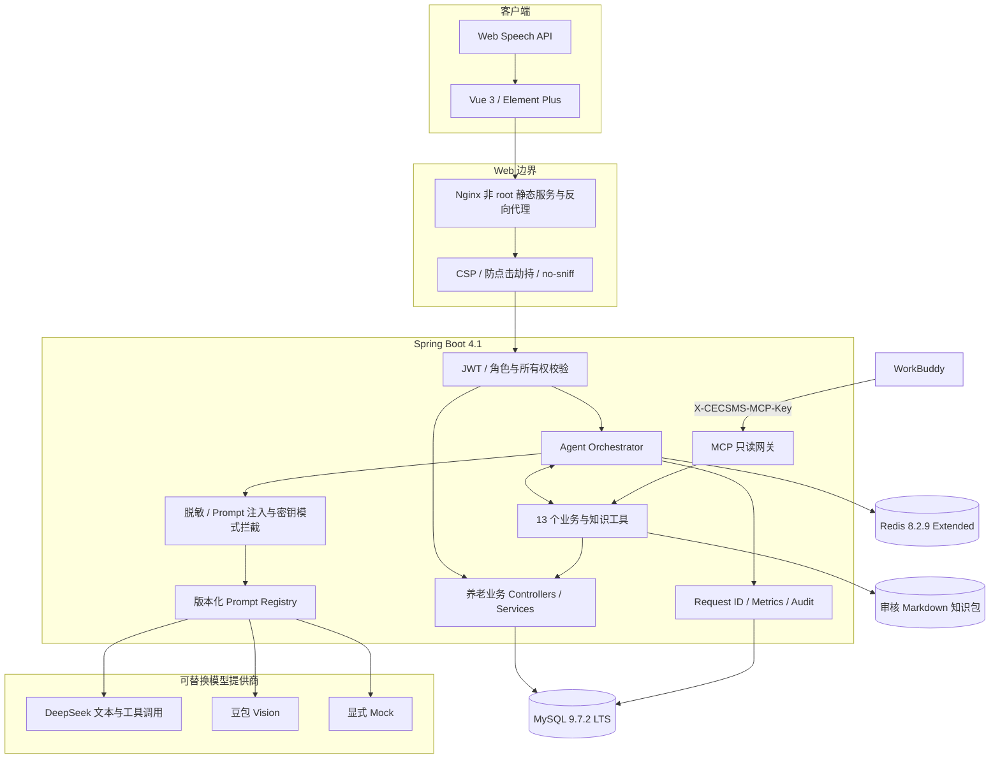
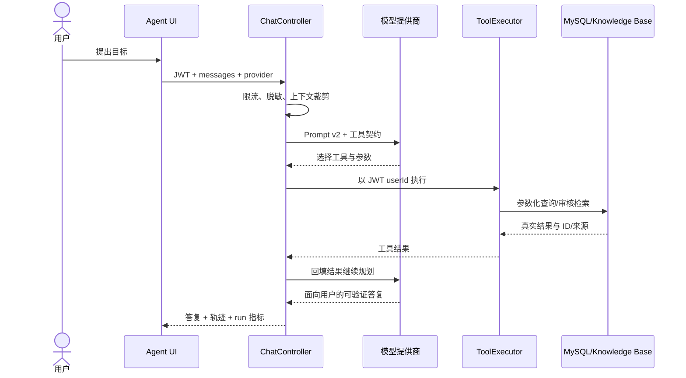
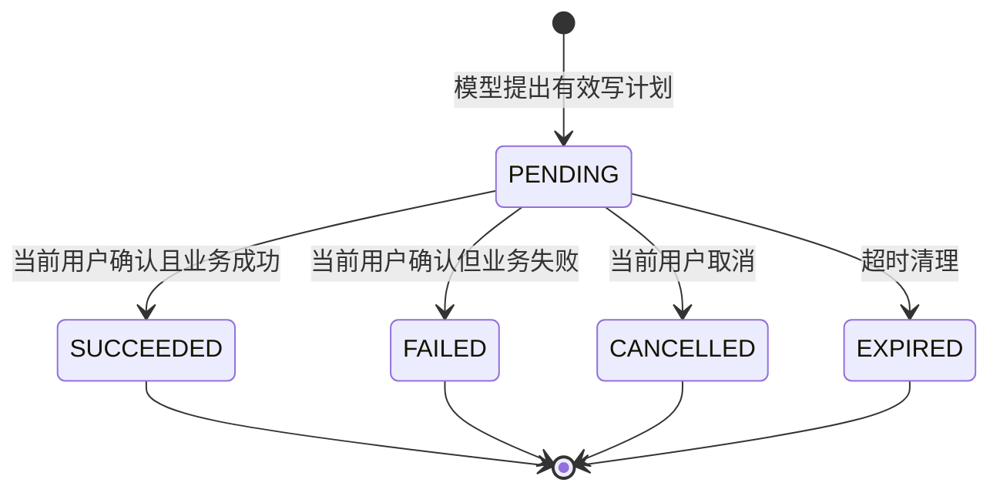

# SilverPilot 系统架构

## 1. 设计目标

SilverPilot 在保留原有活动、服务、健康、助餐、留言和后台管理业务的基础上，引入可验证的 Agent 执行层。核心约束是：模型负责理解和规划，后端负责权限、参数、业务事实与最终执行。

## 2. 运行时组件

| 组件 | 责任 | 明确不做 |
| --- | --- | --- |
| Vue 小伴服务工作台 | 收集目标、展示轨迹/来源/确认卡/指标 | 不保存模型密钥，不直接访问数据库 |
| `ChatController` | 编排、安全门禁、上下文与 Token 上限、降级 | 不绕开业务服务写表 |
| `AiProviderService` | DeepSeek、豆包、Mock 的能力路由 | 不把不支持图片的模型伪装成多模态 |
| `ToolExecutor` | 工具参数校验、用户归属、业务调用 | 不信任模型提供的用户 ID 或执行结果 |
| `AgentActionService` | 待确认、过期、取消、幂等执行 | 不在模型调用阶段直接落库 |
| `KnowledgeBaseService` | 只索引已批准文档、缓存检索、保留来源 | 不抓取未经审核的互联网文本 |
| `AgentRunService` | 记录模型、延迟、工具数、Token、状态 | 不保存原始 Prompt、图片或思维链 |
| `McpController` | WorkBuddy 非个人只读集成 | 不暴露健康数据与业务写操作 |

### 2.1 数据访问与 UI 组件边界

MyBatis-Plus 不是旁路依赖：实体元数据驱动 `BaseMapper`/`ServiceImpl`，条件查询统一使用 Lambda 方法引用；全表攻击拦截器保护写 SQL，限定单页 100 条的 MySQL 分页拦截器按官方建议放在拦截器链最后。复杂联表仍保留显式 Mapper XML，避免把 ORM 包装器强行用于不适合的查询。

Element Plus 由应用级 `ElConfigProvider` 提供中文环境，`unplugin-vue-components` 在构建期解析实际使用组件。Pinia 保留业务状态，Element Plus 负责输入、校验、上传、反馈和数据展示；前端不直接复制一套组件状态机。ESLint/Vue 规则、Element API 契约测试和 Knip 共同阻断弃用语法、无引用模块与空占位实现。

## 3. Agent 读请求

后端最多允许 8 轮工具迭代，并对单次生成和整次运行设置 Token 上限；超过边界会失败或降级，不无限递归。

## 4. Agent 写请求与人工确认

模型选择写工具后，`ToolExecutor.prepare` 只验证参数并生成计划。`AgentActionService` 创建随机确认令牌和默认 10 分钟有效期，状态为 `PENDING`。只有令牌所属用户调用确认接口，数据库状态原子地从 `PENDING` 抢占后，业务写操作才执行；重复请求不会重复下单。

动作结束后清除原始工具参数，仅保留脱敏摘要与结果，降低审计表中的敏感信息暴露。

## 5. 结构化照护方案

`POST /chat/care-plan` 先从数据库读取当前有效的服务小类，再检索已批准知识片段，把允许的服务 ID 与来源交给模型。返回 JSON 经字段、枚举、数量、服务 ID、服务名称和 evidence allowlist 校验；校验失败不会把未经验证的推荐直接返回。

此能力是服务导航和照护沟通辅助，不是诊断、处方或自动预约。紧急症状规则优先提示联系 `120` 或就近急诊。

## 6. 数据与状态

| 存储 | 数据 | 生命周期 |
| --- | --- | --- |
| MySQL 业务表 | 用户、活动、服务、健康报告、菜谱与订单等 | 持久化 |
| `agent_action` | 待确认动作、所有权、有效期、脱敏审计 | 持久化；参数在终态清除 |
| `agent_run` | provider、promptVersion、延迟、工具数、Token、状态 | 持久化；无原始 Prompt/图片 |
| Redis | Agent/登录/验证码共享限流计数 | 带 TTL；代码保留有界应急保护，但受支持的本地模式要求 Docker Redis 健康，不把进程内 fallback 视为运行拓扑 |
| Markdown 知识包 | 版本、owner、status、reviewedAt、正文 | Git 治理；运行时只读 |
| 浏览器 sessionStorage | JWT、当前用户、当前会话显示历史 | 标签页会话；不保存模型 Key |

## 7. 角色和边界

系统角色沿用原业务：管理员 `1`、社区工作者 `2`、医生 `3`、普通用户 `4`。JWT subject 是数据库用户 ID；每次请求重新读取角色。普通用户只能查看或操作自己的订单/报告，后台写接口按角色限制。Agent 永远使用 JWT 用户 ID，忽略模型或客户端自报的用户身份。

## 8. 部署拓扑

本地分离模式使用宿主机 MySQL，只容器化 Redis，并以版本、认证、AOF、回环端口和健康门禁阻止 Redis 降级；IDEA 是 Spring Boot/Java 进程的唯一所有者，VSCode 是 Vue/Vite 进程的唯一所有者，本地脚本不会在 IDE 之外创建两端进程。全容器模式增加 Docker MySQL、后端与 Nginx 前端，Compose 通过 `service_healthy` 保证 MySQL/Redis → 后端 → 前端的启动顺序，并使用三个命名卷持久化数据库、Redis AOF 与上传文件。

生产部署仍需在 Compose 外增加 HTTPS/API 网关、托管密钥、集中日志与告警、数据库备份/恢复、对象存储和恶意文件扫描。当前 Compose 是可复现的本地/演示基线，不是宣称完成生产托管。
