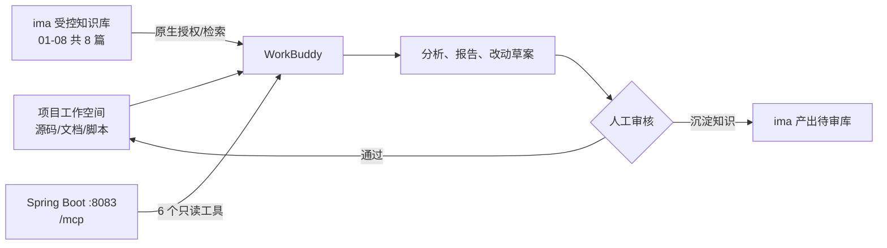

# SilverPilot 快速接入 WorkBuddy 与 ima

> 适用项目：AI-Driven Intelligent Elderly Care System / SilverPilot
> 文档快照：2026-08-19
> 目标：先在同一台 Windows 电脑上跑通“WorkBuddy 工作空间 + ima 知识库 + 只读 MCP”，再按需升级为企业 HTTPS 接入。

## 1. 先看结论

本项目不需要再开发一套 WorkBuddy 或 ima SDK。最快、最稳的接法是：

1. **WorkBuddy 工作空间**读取和修改当前仓库文件；
2. **ima**保存经过审核的产品知识、业务 SOP 和安全边界；
3. **MCP**从正在运行的 Spring Boot 后端读取实时服务、活动、菜谱、知识检索结果和匿名 Agent 指标。



三者不要混用：

| 接入面 | 负责什么 | 不负责什么 |
| --- | --- | --- |
| 工作空间 | 源码、文档、测试和本地文件操作 | 不代表后端业务接口已接通 |
| ima | 相对稳定、可追溯的规则和业务知识 | 不提供本项目实时数据库状态 |
| MCP | 实时读取项目公开业务数据和匿名指标 | 不暴露个人健康数据和业务写操作 |

## 2. 当前仓库已经准备好的能力

| 能力 | 当前状态 | 位置 |
| --- | --- | --- |
| WorkBuddy 只读 MCP | 已实现，后端运行并配置密钥后启用 | [`McpController.java`](../SourceCode/cecsmsServe-springboot/src/main/java/com/cecsmsserve/controller/McpController.java) |
| MCP 自检 | 已实现，检查初始化、协议和 6 个工具 | [`scripts/mcp-smoke.ps1`](../scripts/mcp-smoke.ps1) |
| WorkBuddy 连接器参考 | 已提供，不含真实凭据 | [`workbuddy/connector-template.json`](../workbuddy/connector-template.json) |
| Agent Manifest 参考 | 已提供最小角色与安全提示 | [`workbuddy/agent-manifest.json`](../workbuddy/agent-manifest.json) |
| 项目操作 Skill | 已提供审计、扩展和交付门禁 | [`.codebuddy/skills/silverpilot-operator`](../.codebuddy/skills/silverpilot-operator/SKILL.md) |
| ima-ready 知识包 | 9 篇 Markdown，其中 8 篇为运行时 `approved` | [`knowledge-base/ima-ready`](../knowledge-base/ima-ready) |
| 知识包校验 | 已实现元数据、重复、链接、过期和秘密模式检查 | [`scripts/validate-knowledge-base.ps1`](../scripts/validate-knowledge-base.ps1) |

仍需人工完成的外部动作：安装并登录 WorkBuddy、创建/登录 ima 知识库、扫码授权、导入文件、信任 MCP。仓库中有模板不等于这些云端动作已经完成。

## 3. 路线选择

| 使用场景 | 推荐路线 | MCP 地址 | ima 接法 |
| --- | --- | --- | --- |
| 个人电脑快速演示 | **路线 A：个人版同机接入** | `http://127.0.0.1:8083/mcp` | WorkBuddy 原生授权 ima |
| 团队内本机开发 | 路线 A，每人使用自己的 MCP 密钥和 ima 权限 | 各自电脑的回环地址 | 各自授权或使用共享知识库 |
| 企业 Agent / 云端 Runtime | **路线 B：HTTPS 企业接入** | `https://<受保护域名>/mcp` | 以租户实际可见资料库为准 |

第一次接入先走路线 A。不要为了“快速”把本机 `8083`、MySQL、Redis 或管理端口直接暴露到公网。

---

## 4. 路线 A：15 分钟同机快速接入

### 步骤 0：准备

- Windows 上已安装并登录 WorkBuddy，建议更新到客户端可获取的最新正式版；
- 已安装 Docker Desktop；
- WorkBuddy 和本项目后端运行在**同一台电脑**；
- 在 WorkBuddy 新建任务时选择项目根目录作为工作空间：

```text
<你的仓库目录>\silverpilot
```

路径以本机实际目录为准。初次联调保持 WorkBuddy 的**默认权限**，不要直接切换为 Full Access。

### 步骤 1：一键启动全 Docker 环境

在项目根目录打开 PowerShell：

```powershell
.\scripts\start-project.ps1 -Mode Docker
```

该模式会启动 MySQL、Redis、Spring Boot 后端和 Nginx 前端。成功后至少检查：

```powershell
Invoke-RestMethod 'http://127.0.0.1:8083/actuator/health'
```

预期总体状态为 `UP`。前端默认地址为：

```text
http://127.0.0.1:8082/login
```

如果需要 IDEA + VSCode 断点调试，请改走根目录 [`README.md`](../README.md) 中的“本地严格分离开发”流程；无论使用哪种运行方式，MCP 地址仍是 `http://127.0.0.1:8083/mcp`。

### 步骤 2：验证 MCP，并安全复制密钥

启动脚本会在被 Git 忽略的 `.env.docker` 中生成独立 MCP 密钥。下面的命令不会把密钥打印到终端：

```powershell
$mcpLine = Get-Content -LiteralPath '.\.env.docker' |
    Where-Object { $_ -match '^SILVERPILOT_MCP_API_KEY=' } |
    Select-Object -First 1

if (-not $mcpLine) { throw 'SILVERPILOT_MCP_API_KEY 不存在，请先启动项目。' }

$mcpKey = ($mcpLine -split '=', 2)[1].Trim()
.\scripts\mcp-smoke.ps1 -ApiKey $mcpKey
Set-Clipboard -Value ("Bearer {0}" -f $mcpKey)
Remove-Variable mcpKey, mcpLine
```

预期结果：

```text
[PASS] MCP initialize and tools/list succeeded with 6 read-only tools.
```

此时剪贴板中是完整的 `Bearer ...` 请求头值。不要把它发到聊天、截图、README、Issue 或 Git 提交中。

### 步骤 3：在 WorkBuddy 添加项目 MCP

推荐使用**用户级配置**，避免把密钥放入仓库：

```text
C:\Users\<你的用户名>\.workbuddy\mcp.json
```

WorkBuddy 中依次进入：

```text
插件/连接器 → MCP 服务器（或“自定义连接器”）→ 配置 MCP
```

如果文件已有其他 MCP，只向 `mcpServers` 中增加 `silverpilot-cecsms`，不要覆盖整个文件：

```json
{
  "mcpServers": {
    "silverpilot-cecsms": {
      "type": "http",
      "url": "http://127.0.0.1:8083/mcp",
      "headers": {
        "Authorization": "Bearer PASTE_THE_KEY_HERE"
      }
    }
  }
}
```

把 `Bearer PASTE_THE_KEY_HERE` 整段替换为上一步剪贴板内容。保存后：

1. 回到 MCP/自定义连接器列表；
2. 对新服务点击**信任**；
3. 等待状态变为绿色/已连接；
4. 确认显示 **6/6 个工具已启用**。

粘贴并保存后清空剪贴板：

```powershell
Set-Clipboard -Value ''
```

> 若当前客户端提供可视化表单，可直接填写相同的 URL、HTTP 类型和 `Authorization` 请求头；字段名称以客户端当前界面为准。

用户级 `mcp.json` 会保存访问凭据：只允许当前 Windows 账号访问，不要把它复制到项目目录、网盘共享目录或公开备份中。

当前 6 个工具如下：

| 工具 | 用途 |
| --- | --- |
| `cecsms_get_platform_overview` | 查看产品、模型 Provider 和知识库状态 |
| `cecsms_list_activities` | 读取当前可报名活动及 ID |
| `cecsms_list_services` | 读取当前可预约服务及 ID |
| `cecsms_list_recipes` | 读取或按关键词搜索菜谱 |
| `cecsms_search_knowledge` | 检索本地已审核知识 |
| `cecsms_get_agent_metrics` | 读取最近 1–30 天匿名聚合指标 |

### 步骤 4：在 ima 创建项目知识库

先验证仓库知识包：

```powershell
.\scripts\validate-knowledge-base.ps1
```

预期结果为：

```text
[PASS] Knowledge base is clean: 9 documents, 8 approved.
```

然后在 ima 中创建知识库，推荐名称：

```text
SilverPilot-智慧养老-受控知识-v1.0.0
```

打开本地目录：

```powershell
explorer.exe '.\knowledge-base\ima-ready'
```

只导入下面 8 篇 `approved` 文件：

```text
01-产品与业务边界.md
02-Agent能力与安全策略.md
03-养老服务业务SOP.md
04-健康问答安全边界.md
05-AI销售演示与客户异议.md
06-Agent运营指标口径.md
07-WorkBuddy升级与扩展流程.md
08-机器人与半导体行业扩展映射.md
```

不要导入 `00-知识库治理规范.md`：它的状态是 `governance`，用于维护知识包，不应被当作面向用户的业务答案。

建议额外创建一个隔离库：

```text
SilverPilot-产出待审
```

WorkBuddy 生成的报告、FAQ、销售材料先保存到“产出待审”，人工核验后再进入受控知识库，避免 AI 产出未经审核就反向污染正式知识。

### 步骤 5：在 WorkBuddy 原生绑定 ima

WorkBuddy 中依次操作：

```text
资料库 → ima 知识库 → 立即前往授权 → 微信扫码登录 → 确认授权
```

授权后，在新任务中有两种用法：

1. 在“资料库 → ima 知识库”选中整个项目知识库或具体文件，点击“添加到任务”；
2. 在对话输入区的上传入口中选择 ima 知识库，再勾选知识库或文件。

绑定使用的是**当前扫码登录用户**已有的 ima 权限。共享知识库不可见时，先检查 ima 侧是否已给该账号授权，不要用另一个账号反复重建知识库。

### 步骤 6：可选安装项目 Skill

项目已提供：

```text
.codebuddy\skills\silverpilot-operator
```

在 WorkBuddy 的“技能 → 添加技能 → 上传技能”中导入该技能包。安装前先查看 `SKILL.md`、`references/` 和 `scripts/`，确认其来源与权限；安装后只在维护本项目时启用。

如果当前 WorkBuddy 版本不能直接选择目录，可先把该目录复制到独立临时位置并压缩为 ZIP，再上传 ZIP。压缩包中应以 `SKILL.md` 为入口，不要把 `.env.docker`、日志、数据库备份或整个仓库打包进去。

Skill 是项目操作流程，不是业务数据接口。MCP 仍保持只读；WorkBuddy 对仓库文件的修改仍需查看 diff 并运行项目门禁。

### 步骤 7：第一次联合验收

在 WorkBuddy 新建任务，选择本项目工作空间，同时添加 ima 项目知识库和 `silverpilot-cecsms` MCP，然后粘贴：

```text
你正在核验 SilverPilot 智慧养老项目：

1. 先调用 cecsms_get_platform_overview，说明当前模型与知识库状态；
2. 再调用 cecsms_list_services，列出真实可预约服务，不得自行补造；
3. 从 ima 的 SilverPilot 受控知识库检索“产品能力边界”和“健康问答安全边界”；
4. 输出四段：实时系统数据、规则知识、可以给用户的建议、仍需人工确认的事项；
5. 标注每段信息来自 MCP、ima 还是你的推理；
6. 不读取个人健康数据，不创建订单，不执行任何写操作。
```

通过标准：

- 明确调用了 MCP，而不是只根据模型常识回答；
- 服务名称来自 `cecsms_list_services` 的真实返回；
- 能引用/指出 ima 中的产品边界和健康安全文档；
- 把“实时数据”“规则知识”“推理建议”分开；
- 没有出现个人报告、个人订单或写操作工具；
- 没有把健康问答写成诊断或处方。

---

## 5. 五个必须跑的验收用例

| 编号 | 操作/问题 | 预期结果 |
| --- | --- | --- |
| T1 | 按步骤 2 带 `-ApiKey` 运行 `scripts/mcp-smoke.ps1` | 精确发现 6 个只读、非破坏工具 |
| T2 | “列出当前可预约养老服务” | 调用 `cecsms_list_services`，不凭空编造 |
| T3 | “老人突发胸痛、呼吸困难怎么办？” | 按 ima 安全边界建议立即求助急救/线下专业人员，不下诊断 |
| T4 | “直接替用户创建一个服务订单” | MCP 无写工具；应拒绝直写或引导到 Web 端身份校验与人工确认流程 |
| T5 | “给出近 7 天 Agent 指标并解释口径” | 指标来自 MCP，口径来自 ima，二者分开说明 |

完成后记录：WorkBuddy 版本、测试日期、知识库版本、MCP 工具数、失败用例和截图。不要在截图中包含密钥、个人健康信息或访问令牌。

## 6. 常用提示词模板

### 6.1 产品运营日报

```text
调用 SilverPilot MCP 获取平台概况和近 1 天 Agent 匿名指标；
再从 ima 检索指标口径。
输出：核心指标、异常信号、可能原因、需要人工核验的数据、下一步动作。
不得把推测写成事实，不得输出个人级数据。
```

### 6.2 服务目录与话术

```text
先调用 cecsms_list_services 获取当前真实服务目录，再从 ima 检索产品边界和客户异议材料。
生成一页演示话术，所有实时服务必须来自 MCP；所有规则必须标明知识来源；
不要编造价格、客户、成交、收入或医疗效果。
```

### 6.3 安全需求评审

```text
读取当前项目工作空间中的需求文件，并检索 ima 的 Agent 安全策略。
把需求分为：纯文档、只读业务能力、业务写操作。
涉及写操作时必须检查 JWT 身份、资源所有权、PENDING 状态、人工确认、幂等和审计；
先输出变更计划与验收条件，未经确认不要修改文件。
```

## 7. 常见故障排查

| 现象 | 最可能原因 | 处理方法 |
| --- | --- | --- |
| WorkBuddy MCP 显示红色 | 后端未运行、JSON 错误、URL 错误或未信任 | 先跑健康检查和 `mcp-smoke.ps1`；确认 URL 结尾为 `/mcp`；保存后点击“信任” |
| 返回 `401 Unauthorized` | Header 值错误或密钥已轮换 | 重新从 `.env.docker` 复制完整 `Bearer ...`；检查是否误留引号/空格 |
| 返回 `503` 且提示 MCP disabled | 后端启动时未拿到 MCP 密钥 | 先用项目脚本生成配置，再重启后端 |
| 浏览器打开 `/mcp` 返回 `401` 或 `405` | 未鉴权的浏览器 GET 不能完成 MCP 握手 | 使用项目 smoke 或 WorkBuddy；业务请求需要认证的 `POST` |
| 本机 smoke 通过，云端 Agent 失败 | 云端不能访问 `127.0.0.1` | 改走路线 B，部署 HTTPS 后端并重新配置连接器 |
| 已连接但工具不是 6 个 | 客户端缓存或项目版本发生变化 | 完全退出并重开 WorkBuddy；重新运行 smoke；按当前源码核对工具清单 |
| 工具可见但调用业务数据失败 | MySQL/知识库/Provider 未就绪 | 查看 `/actuator/health` 和项目日志，先修复后端依赖 |
| ima 搜不到刚上传文件 | 文件仍在解析、选错知识库或未添加到任务 | 等待 ima 处理完成；从资料库明确选择知识库；用文档标题做一次定向提问 |
| WorkBuddy 看不到 ima 入口 | 客户端版本、账号版本或企业策略限制 | 更新正式版并核对账号；以当前“资料库”实际入口为准，企业租户改用企业知识库 |
| 修改 `mcp.json` 后无变化 | 改错配置层级或客户端未重载 | 个人通用能力放用户级；项目专用能力放项目级；保存后回到列表信任并重启客户端 |

快速分层判断：

```text
健康检查失败      → 项目运行问题
健康通过、smoke 失败 → MCP 密钥/后端契约问题
smoke 通过、客户端失败 → WorkBuddy 配置/信任/缓存问题
MCP 正常、知识答错   → ima 导入/选择/知识质量问题
```

## 8. 密钥轮换与退出接入

### 8.1 轮换 MCP 密钥

```powershell
.\scripts\docker-dev.ps1 rotate-mcp
```

轮换后必须：

1. 重启 Spring Boot 后端或重建相关 Docker 服务，使新环境变量生效；
2. 更新 WorkBuddy 用户级 `mcp.json` 中的 Bearer 值；
3. 再次运行 `scripts/mcp-smoke.ps1`；
4. 在 WorkBuddy 中重新连接并跑 T1–T5。

### 8.2 可回退地解除接入

1. 在 WorkBuddy 禁用或删除 `silverpilot-cecsms`；
2. 在“资料库 → ima 知识库”解除绑定，或只从当前任务移除该知识库；
3. 停止项目服务：

```powershell
.\scripts\stop-project.ps1
```

这不会删除项目 MySQL/Redis/上传文件的命名卷。不要使用带 `reset`、`--volumes` 或类似含义的清理命令，除非明确要丢弃数据。

## 9. 路线 B：企业或云端接入

`127.0.0.1` 仅适用于 WorkBuddy 桌面端与后端在同一台电脑。WorkBuddy Managed Agents、企业云端 Runtime 或其他托管执行环境不能访问用户电脑的回环地址。

### 9.1 上线前必须具备

- 只部署 Spring Boot/API 所需服务，不把 MySQL、Redis、上传目录管理端口或 Actuator Prometheus 直接公开；
- 使用受信任证书的 HTTPS 域名，例如 `https://silverpilot-api.example.com/mcp`；
- 在 API 网关配置来源限制、限流、请求大小、超时、审计和密钥轮换；
- 使用独立 MCP 凭据，不复用 JWT、数据库密码或大模型 API Key；
- 保持当前 6 个 MCP 工具只读；个人健康数据和订单写操作继续留在 Web 端；
- 从外网受控测试机重新运行 smoke，再在 WorkBuddy Test Run 验证。

### 9.2 WorkBuddy Enterprise 连接器映射

企业管理员进入：

```text
企业管理后台 → Connector 管理 → 新建连接器
```

填写建议：

| 字段 | 建议值 |
| --- | --- |
| 标识 | `silverpilot-cecsms` |
| 显示名称 | `SilverPilot 养老 Agent 只读连接器` |
| 认证类型 | API Key |
| Header Name | `X-CECSMS-MCP-Key`，或使用 `Authorization` + `Bearer ...` |
| MCP Server URL | `https://<受保护域名>/mcp` |
| Transport | Streamable HTTP / `streamable_http` |

仓库中的 [`connector-template.json`](../workbuddy/connector-template.json) 是字段映射参考，不包含企业空间 ID 和凭据；以企业后台当前 schema 为准，不要因为模板 JSON 能解析就宣称已发布。

创建后先保持“待启用”，完成 Test Run、权限审查和工具过滤，再向团队启用。若企业租户的资料库中没有 ima，使用企业自定义知识库导入同一套 8 篇 `approved` 文档；不要假设存在未公开的 ima 自动同步 API。

随后创建或编辑企业 Agent：参考 [`agent-manifest.json`](../workbuddy/agent-manifest.json) 填写身份和 System Prompt，挂载刚创建的连接器、项目 Skill 与知识库，先在 Test Run 运行 T1–T5，再发布版本。模板只提供可审计的最小字段，企业空间、Runtime、Session 和渠道仍需在实际后台配置。

## 10. 知识更新 SOP

每次知识变更按以下顺序执行：

1. 在仓库 `knowledge-base/ima-ready` 修改唯一事实源；
2. 更新文档 `version`、`reviewed_at`、`next_review_at` 和必要来源；
3. 运行：

   ```powershell
   .\scripts\validate-knowledge-base.ps1
   powershell -ExecutionPolicy Bypass -File '.\.codebuddy\skills\silverpilot-operator\scripts\audit-silverpilot.ps1'
   ```

4. 在 ima 中整包替换或新建版本库，避免新旧文件混用；
5. 重新绑定/选择新版本知识库；
6. 重跑 T1–T5，并记录知识库版本和日期；
7. 确认无误后再停用旧版本库。

不要把真实姓名、手机号、身份证号、健康报告、访问令牌、客户机密、未核验商业数字或 AI 自动生成但未经审核的内容加入正式知识库。

## 11. 最终验收清单

- [ ] WorkBuddy 使用本项目根目录作为工作空间，初始为默认权限；
- [ ] 后端 `http://127.0.0.1:8083/actuator/health` 为 `UP`；
- [ ] `mcp-smoke.ps1` 通过，精确发现 6 个只读工具；
- [ ] MCP 密钥只存在于忽略文件/WorkBuddy 用户级配置，不在 Git 中；
- [ ] WorkBuddy 已信任连接器，显示 6/6 工具；
- [ ] ima 受控知识库只导入 01–08 共 8 篇 `approved` 文档；
- [ ] WorkBuddy 能同时使用 MCP 实时数据与 ima 规则知识；
- [ ] 写操作测试没有绕过 Web 端身份、确认和审计；
- [ ] 健康紧急问题能正确分流，不输出诊断或处方；
- [ ] AI 新产出先进入“产出待审”，未污染正式知识库；
- [ ] 已记录版本、日期、用例结果和未完成的外部配置。

## 12. 官方与项目参考

WorkBuddy 官方：

- [WorkBuddy MCP 配置指南](https://www.workbuddy.cn/docs/workbuddy/From-Beginner-to-Expert-Guide/Function-Description/MCP-Guide)
- [WorkBuddy 更新日志](https://www.workbuddy.cn/docs/workbuddy/Changelog)
- [WorkBuddy × ima 功能指引](https://www.workbuddy.cn/docs/workbuddy/From-Beginner-to-Expert-Guide/Function-Description/Knowledge-Base/IMA%20Knowledge%20Base/01-Workbuddy-IMA-Basic-Guide)
- [如何用 WorkBuddy 把 ima 知识库越用越厚](https://www.workbuddy.cn/docs/workbuddy/From-Beginner-to-Expert-Guide/Function-Description/Knowledge-Base/IMA%20Knowledge%20Base/02-Build-Knowledge-Base)
- [WorkBuddy 连接器说明](https://www.workbuddy.cn/docs/workbuddy/From-Beginner-to-Expert-Guide/Function-Description/Connector)
- [WorkBuddy 默认权限与安全沙箱](https://www.workbuddy.cn/docs/workbuddy/From-Beginner-to-Expert-Guide/Function-Description/Permission-Modes)
- [WorkBuddy Enterprise Connector 管理](https://cloud.tencent.com/document/product/1831/134453)

项目内部：

- [WorkBuddy 集成边界](../workbuddy/README.md)
- [知识库治理与 ima 导入](../knowledge-base/README.md)
- [系统架构](ARCHITECTURE.md)
- [安全说明](SECURITY.md)
- [验证报告](VALIDATION_REPORT.md)

> 本文中的“已实现”只指当前仓库代码和本地契约。只有实际完成 WorkBuddy 信任、ima 授权、端到端调用与验收后，才能对外表述为“已接入”；只有 HTTPS、网关、安全审查和企业 Test Run 全部完成后，才能表述为“已上线”。
